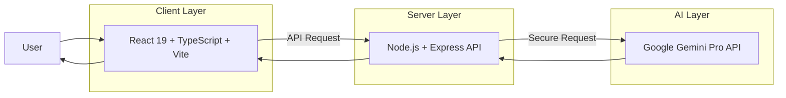

# 🛡️ Surakshamitra Healthguard
### AI-Powered Digital Health Companion


---

# 🧠 Overview

**Surakshamitra Healthguard** is an AI-driven digital health platform that acts as a **personal medical assistant, fitness tracker, and mental wellness companion**.

Unlike traditional health apps that only track metrics, Surakshamitra combines:

- Physical health monitoring
- Mental wellness analysis
- AI-powered medical assistance
- Medical document interpretation
- Personalized fitness planning

All powered by **Google Gemini AI models**.

---

# 🎯 Core Mission

The goal of **Surakshamitra Healthguard** is to build an **intelligent health ecosystem** that can:

✔ Monitor physical health indicators  
✔ Analyze emotional well-being  
✔ Understand complex medical documents  
✔ Provide personalized health insights  
✔ Assist users in daily wellness decisions  

---

# 🏗 System Architecture

The project follows a **decoupled architecture** used in modern production applications.

Benefits:

- 🔐 Security
- ⚡ Performance
- 📈 Scalability
- 🚀 Production readiness

---

## Architecture Workflow



---

# 📁 Project Structure

```
surakshamitra-healthguard/

├── frontend/
│   ├── src/
│   │   ├── components/
│   │   ├── services/
│   │   ├── dashboards/
│   │   └── App.tsx
│   │
│   ├── vite.config.ts
│   └── package.json
│
├── backend/
│   ├── src/
│   │   ├── routes/
│   │   ├── controllers/
│   │   ├── services/
│   │   └── server.ts
│   │
│   ├── .env
│   └── package.json
│
└── README.md
```

---

# 🔐 Security Architecture

Originally the app was **monolithic**, exposing the AI API key.

### Old Architecture

```
Frontend → Gemini API
(API Key exposed ❌)
```

### Production Architecture

```
Frontend → Backend → Gemini API
(API Key hidden in backend .env ✔)
```

Benefits:

- API keys never reach the browser
- Backend controls AI requests
- Prevents unauthorized API use

---

# 🖥 Frontend Stack

Built for **performance, UI interactivity, and scalability**.

Technologies:

- React 19
- TypeScript
- Vite
- Recharts
- Animated UI backgrounds
- Web Speech API

Responsibilities:

- User interface
- Dashboards
- Health charts
- Games & engagement features
- API communication

---

# 🧠 Backend Stack

The backend acts as a **secure AI orchestration layer**.

Technologies:

- Node.js
- Express
- TypeScript
- Google GenAI SDK
- Environment variables (.env)

Responsibilities:

- AI request handling
- Medical document analysis
- Symptom reasoning
- Workout plan generation
- Secure Gemini API access

---

# 🤖 AI Capabilities

| Feature | Gemini Capability |
|------|------|
| Motivational quotes | Text generation |
| Symptom checker | Deep reasoning |
| Prescription scanner | Vision + OCR |
| Mental health analysis | Sentiment analysis |
| Sanctuary images | Image generation |
| Voice wellness advice | Text-to-Speech |
| Medical location search | Maps grounding |

---

# 📊 Interactive Health Dashboard

Tracks daily health metrics:

- 💧 Water Intake
- ❤️ Heart Rate
- 🚶 Steps
- 😴 Sleep Quality

AI adds:

- Daily motivational quotes
- Health-related jokes
- Progress visualization

---

# 🩺 Medical Assistant

Powered by **Gemini Pro multimodal AI**.

### Symptom Checker

Users describe symptoms.

AI:

- analyzes conditions
- suggests possible causes
- recommends medical attention when needed

Uses **Gemini Thinking Mode** for reasoning.

---

### Medical Document Scanner

Upload:

- prescriptions
- medical reports
- X-rays

AI extracts:

- medications
- dosage
- instructions
- potential findings

Outputs simplified readable results.

---

### Nearby Health Services

Using **Maps Grounding**, the system can locate:

- pharmacies
- hospitals
- clinics
- health services

based on user coordinates.

---

# 🧘 Mental Wellness Hub

Users can:

- type their thoughts
- speak using microphone input

AI performs **sentiment analysis** detecting:

- anxiety
- stress
- joy
- calmness

Outputs:

- psychological insights
- calming advice
- meditation images
- soothing audio guidance

---

# 💪 Physical Wellness Hub

Generates personalized workout routines.

Inputs:

- muscle group
- difficulty level

AI produces a structured plan:

```
Exercise
Sets
Reps
Instructions
Muscle Focus
```

---

# 🎮 Gamification

### Suraksha Coins

Users earn rewards for:

- workouts
- hydration goals
- mental wellness tasks
- daily health check-ins

---

### Zen Game

Memory matching game designed to improve:

- focus
- mindfulness
- relaxation

---

### Personality Hub

AI quiz that generates **Health Archetypes** such as:

- The Serene Warrior
- The Balanced Guardian
- The Mindful Strategist

---

# 🚀 Deployment

### Frontend

Recommended platforms:

- Vercel
- Netlify

---

### Backend

Recommended platforms:

- Railway
- Render
- AWS
- Google Cloud Run

---

# 📦 Installation

### Clone Repository

```bash
git clone https://github.com/yourusername/surakshamitra-healthguard.git
cd surakshamitra-healthguard
```

---

### Frontend Setup

```bash
cd frontend
npm install
npm run dev
```

---

### Backend Setup

```bash
cd backend
npm install
```

Create `.env`

```
GEMINI_API_KEY=your_api_key_here
PORT=5000
```

Run backend

```bash
npm run dev
```

---

# 📈 Future Roadmap

- Wearable device integration
- Smartwatch health sync
- AI anomaly detection
- Emergency alert system
- Doctor consultation AI
- Personal medical history timeline

---

# 🤝 Contributing

Contributions are welcome.

1. Fork repository
2. Create feature branch
3. Commit changes
4. Submit pull request

---

# 📄 License

MIT License

---

# 👩‍💻 Author

**Supriya**

AI Developer | Health Tech Innovator
